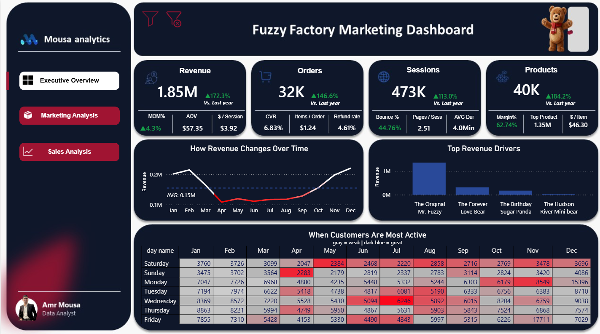
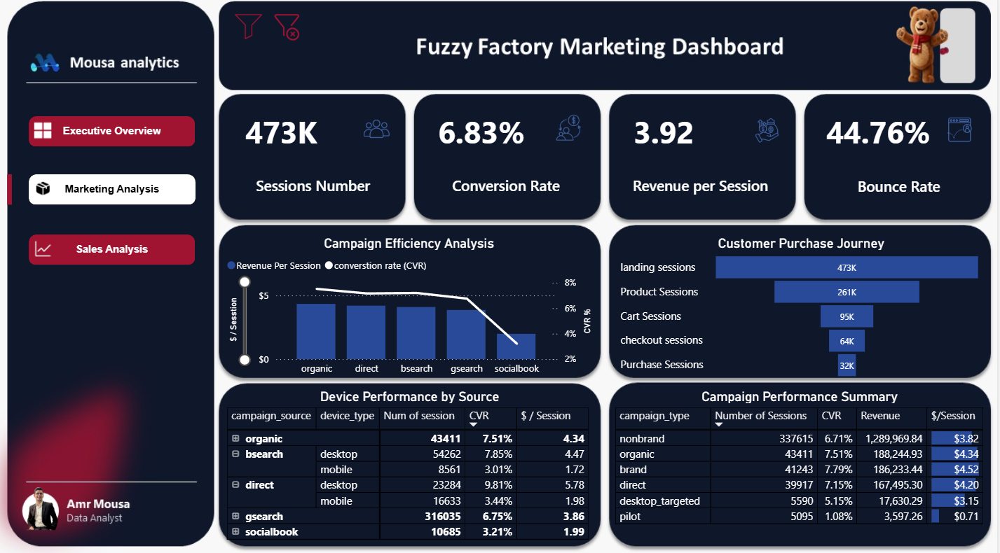
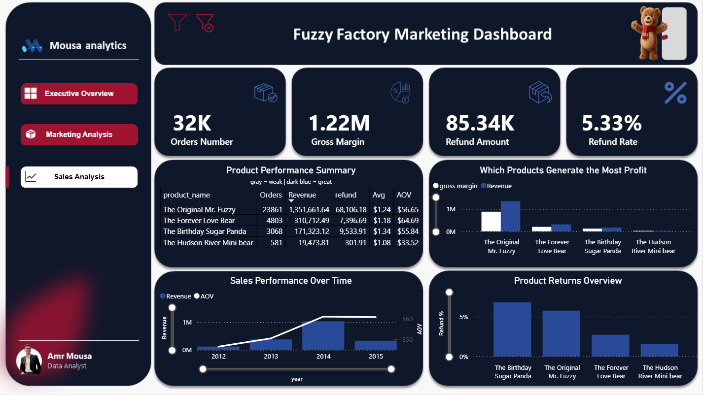

<div align="center">

# Fuzzy Factory Data Analytics

### Turning Raw Data Into Business Insights With SQL & Power BI

<p align="center">

</p>


</div>

---

# About

This project is a complete data analysis case study built around the **Fuzzy Factory** dataset.

The project combines **SQL** and **Power BI** to analyze marketing performance, customer behavior, sales performance, products, revenue, profitability, and refunds.

The main idea was simple.

Take raw business data.

Analyze it with SQL.

Find meaningful patterns.

Then turn those findings into an interactive Power BI dashboard.

This project was a practical experience in connecting **SQL, data analysis, business thinking, and visualization**.

---

# Goal

This project was built to answer practical business questions through data.

The goal was to:

- Analyze marketing performance.
- Understand customer behavior.
- Measure the customer purchase journey.
- Evaluate sales and revenue performance.
- Identify high-performing products.
- Analyze profitability and margins.
- Understand refunds and returns.
- Identify customer activity patterns.
- Turn analytical findings into business insights.

---

# Repository Structure

```text
Fuzzy Factory Data Analytics
│
├── assets
│   ├── executive-overview.png
│   ├── marketing-analysis.png
│   └── sales-analysis.png
│
├── README.md
├── Fuzzy-Factory.sql
├── Fuzzy-Factory.pdf
└── Fuzzy-Factory.pbix
```

---

# Files

| File | Description |
|------|-------------|
| 📊 [Fuzzy-Factory.pbix](./Fuzzy-Factory.pbix) | Power BI dashboard containing the complete analysis |
| 💾 [Fuzzy-Factory.sql](./Fuzzy-Factory.sql) | SQL analysis and business queries |
| 📄 [Fuzzy-Factory.pdf](./Fuzzy-Factory.pdf) | Project analysis and supporting documentation |
| 🖼️ [assets](./assets) | Dashboard previews and project visuals |

---

# Analysis Overview

The project is divided into three main analytical areas.

### Executive Overview

The executive analysis provides a high-level view of overall business performance.

It covers:

- Revenue
- Orders
- Sessions
- Products
- Average Order Value
- Conversion Rate
- Bounce Rate
- Revenue per Session
- Gross Margin
- Refund Rate
- Revenue trends
- Customer activity

### Marketing Analysis

The marketing analysis focuses on acquisition performance and the customer purchase journey.

It covers:

- Campaign performance
- Campaign source performance
- Device performance
- Session volume
- Conversion rate
- Revenue per session
- Customer funnel analysis

The purchase journey is analyzed through:

```text
Landing Sessions
        ↓
Product Sessions
        ↓
Cart Sessions
        ↓
Checkout Sessions
        ↓
Purchase Sessions
```

### Sales Analysis

The sales analysis focuses on products, revenue, profitability, and refunds.

It covers:

- Orders
- Revenue
- Gross margin
- Average Order Value
- Refund amount
- Refund rate
- Product performance
- Product profitability
- Product returns
- Sales performance over time

---

# Key Metrics

| Metric | Value |
|--------|------:|
| Revenue | $1.85M |
| Orders | 32K |
| Sessions | 473K |
| Products | 40K |
| Conversion Rate | 6.83% |
| Revenue per Session | $3.92 |
| Bounce Rate | 44.76% |
| Gross Margin | $1.22M |
| Refund Amount | $85.34K |
| Refund Rate | 5.33% |

---

# Skills Covered

### SQL

- SELECT
- WHERE
- ORDER BY
- DISTINCT
- Aggregate Functions
- GROUP BY
- HAVING
- JOINs
- Subqueries
- Common Table Expressions (CTEs)
- Window Functions
- CASE Expressions
- Analytical SQL
- Business-Oriented SQL Problems

### Power BI

- Data Modeling
- DAX Measures
- KPI Cards
- Interactive Dashboards
- Tables
- Matrix Visuals
- Time-Series Analysis
- Funnel Analysis
- Conditional Formatting
- Heatmaps
- Cross-Filtering

### Data Analysis

- Marketing Analysis
- Customer Behavior Analysis
- Conversion Funnel Analysis
- Sales Analysis
- Product Analysis
- Revenue Analysis
- Profitability Analysis
- Refund Analysis
- Trend Analysis
- KPI Analysis

---

# Preview

### Executive Overview



### Marketing Analysis



### Sales Analysis



---

# Business Questions

The project was built around practical questions.

- Which marketing sources generate the strongest performance?
- How does conversion rate differ across campaigns?
- How does device type affect marketing performance?
- Where do customers drop during the purchase journey?
- Which products generate the most revenue?
- Which products generate the most profit?
- How does revenue change over time?
- Which products have higher refund rates?
- When are customers most active?

---

# Latest Update

**Fuzzy Factory Data Analytics has been completed.**

The project combines SQL analysis and Power BI to explore marketing performance, customer behavior, sales performance, product performance, revenue, profitability, and refunds.

---

# Progress

| Stage | Status |
|-------|--------|
| Dataset Exploration | ✅ Completed |
| SQL Analysis | ✅ Completed |
| Marketing Analysis | ✅ Completed |
| Customer Analysis | ✅ Completed |
| Sales Analysis | ✅ Completed |
| Product Analysis | ✅ Completed |
| Power BI Dashboard | ✅ Completed |
| Documentation | 🔄 Finalizing |
| GitHub Repository | 🔄 Finalizing |

---

# Why I'm Sharing This

This project was an important step in connecting technical SQL skills with real business analysis.

SQL helped me investigate the data.

Power BI helped me communicate the results.

The goal was not simply to create a dashboard.

The goal was to understand the data, find meaningful patterns, and turn those patterns into business insights.

Sharing the project documents that process and provides a reference for future projects.

---

<div align="center">

## From Data To Insights

### One Query At A Time

</div>
